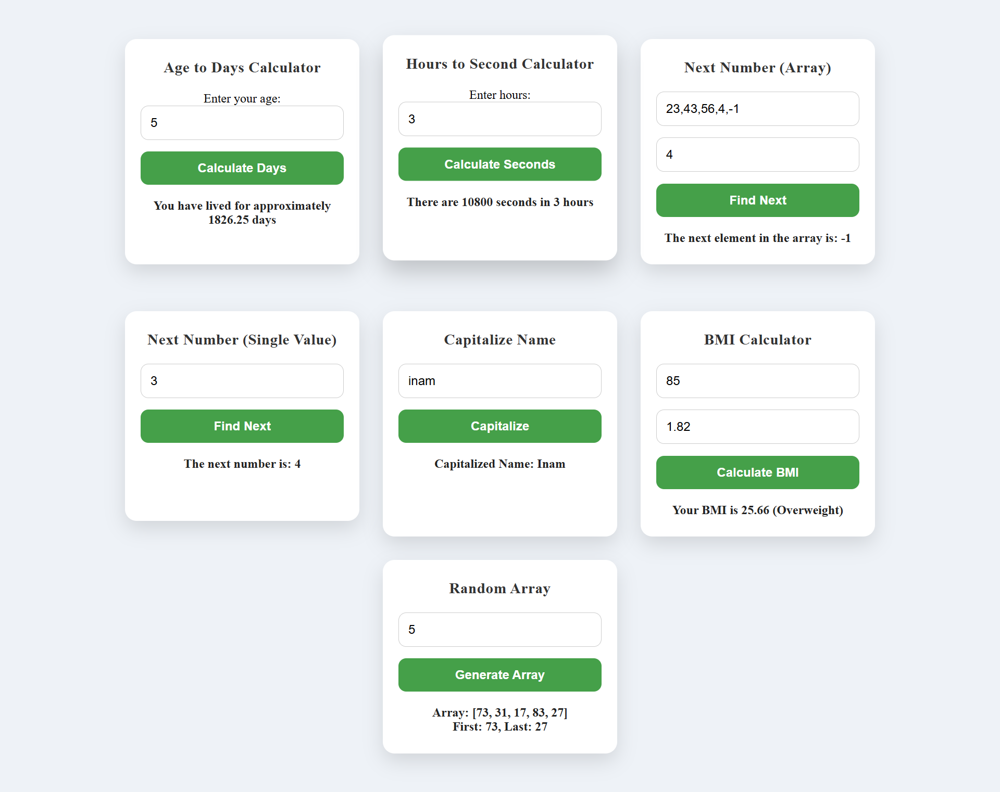

# JavaScript Tasks

## Tasks
1. Age to Days converter : When a user enters age (in years), the converter will convert it to days..
2. Hours to seconds converter
3. Create a function to find the number next to a certain number - 2 scenarios here
   - whether you are finding a number next to a certain number in an array OR
- Ask a user to input a single value and then find next number based on the condition, whether he/she enters an integer or a float.
4. Ask user to enter his/her name( in lowercase only), and then display the name in such a way that the first letter of the name must be capitalised..
5. Create a function to calculate BMI(Body-Mass-Index) by asking user to enter his/her weight and height.
6. Randomly generate an array and then create a function to pick 1st and last element of that generated array..

## Output of all tasks

